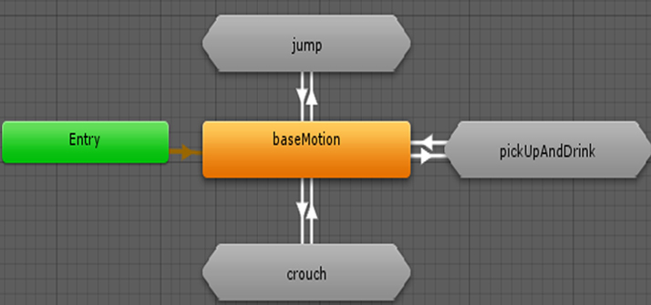
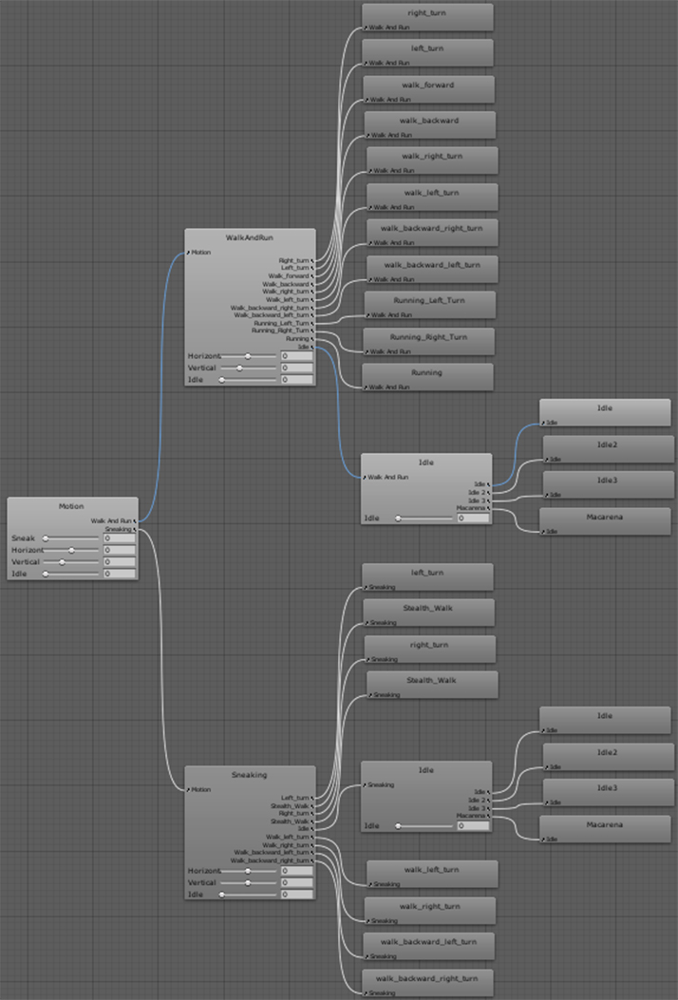
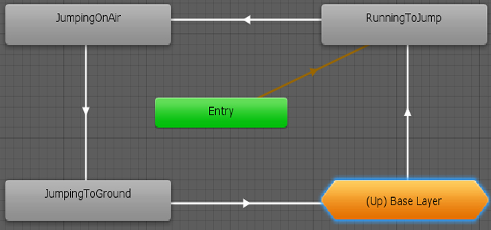
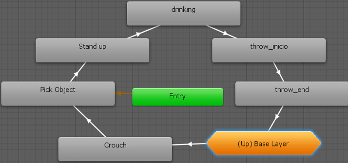
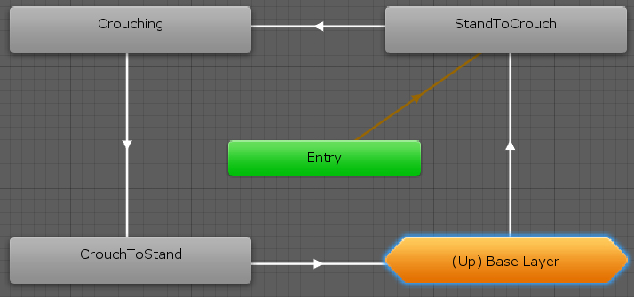
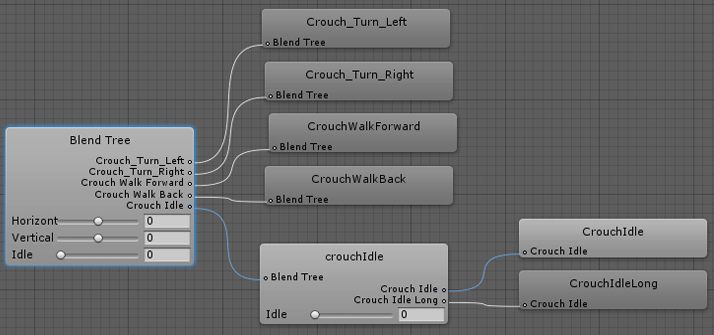

# UnityAnimator
Sample of a character animated in unity using blend trees.

**Please play online on <https://iagocl.github.io/unityAnimator/>** 

On smartphone ignore the unity incompatibility warning. A video demo can also be found on <https://youtu.be/oyC_kiU2pqE>

## Assets
Animations and skeleton were download from [Mixamo](https://www.mixamo.com/#/) and are [free](https://helpx.adobe.com/creative-cloud/faq/mixamo-faq.html) to be included in game development projects.

The *FGC Male Adam* model was created by *MauSan* and can be found here <https://fg3d.net/en/fgc-male-adam-unity-3d-models/>

The church, preacher character and floor texture are personal creations and can be found on <https://github.com/iagoCL/artSamples>.

The joystick control has been created using the [joystick pack](https://assetstore.unity.com/packages/tools/input-management/joystick-pack-107631) from the unity store.

## Scenes

1. Simple tutorial explaining the project and how to control the character using the keyboard.

2. The custom personal character situated in a quasi-infinite plane, designed to explore the character movements.

3. The same custom character is situated in a simple church to illustrate the created set.

4. The FGC model in another semi-infinite plane, this model also contains some quick facial animations and a quick IK action of pick up and drink a can.

To move around scenes a responsible scene menu has been added. To open it press the corresponding button on the left corner.

## Controls

### Keyboard

* **Shift**: Maintain to run.
* **Alt**: Maintain to sneak.
* **C**: Press to crouch.
* **Space**: Press to jump.
* **X**: Press to change the idle animation and the face.
* **R**: Press to change camera mode.
* **M**: Press to open the scene menu.

### Touch

The character and all relevant options can also be controlled using the provided touch controls.

## Animator
The character has different states crouch, jump and the main one. Jump consists of a succession of animations one after the other. In crouch we have a blend tree of the different directions, using a specific animation to change from the main state to crouch. In the main state, we also do a blend tree but in addition to the directions, we also combine the velocity and sneak factor to combine the different animations.

**Main Animator**:

**Locomotion Blend Tree**:

**Jump Animator**:

**Pick Up Animator**:

**Crouch Animator**:

**Crouch Blend Tree**:

